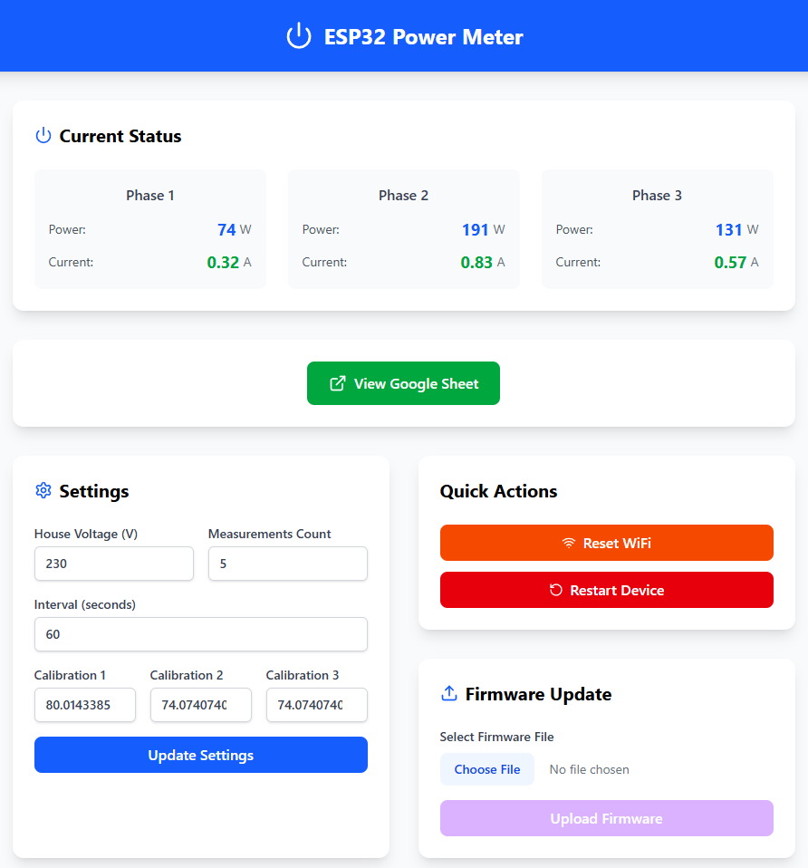
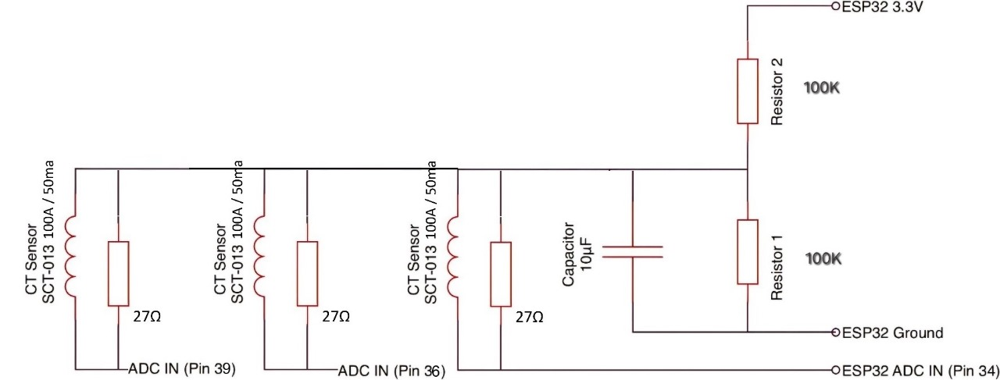

# ESP32 Home Energy Monitor

[](https://opensource.org/licenses/MIT) [](https://platformio.org/) [](https://www.espressif.com/en/products/socs/esp32)

A wireless energy monitoring system built with ESP32 that measures current and power consumption across 3 independent circuits. Features real-time data logging to Google Sheets, a modern web dashboard, over-the-air updates, and precise calibration capabilities. Working on serverless data processing at the moment.


_Modern web interface showing real-time current measurements across three phases_

## 🚀 Features

### Core Monitoring

- **3-Phase Current Monitoring**: Simultaneous measurement of up to 3 circuits using CT sensors
- **Real-time Power Calculation**: Automatic power computation using configurable house voltage
- **12-bit ADC Resolution**: Enhanced precision with ESP32's 12-bit ADC capabilities
- **Configurable Sampling**: Adjustable measurement intervals and sample counts

### Connectivity & Logging

- **Google Sheets Integration**: Automatic data logging with configurable intervals
- **WiFi Manager**: Easy network configuration with captive portal
- **Static IP Support**: Reliable network connectivity with predefined IP settings
- **NTP Time Synchronization**: Accurate timestamping for all measurements

### User Interface

- **Modern Web Dashboard**: Real-time monitoring interface
- **Settings Management**: Easy calibration and configuration updates
- **OTA Updates**: Over-the-air firmware updates via web interface
- **Mobile Responsive**: Works seamlessly on mobile devices

### System Features

- **FreeRTOS Tasks**: Efficient multi-core processing
- **Watchdog Protection**: Automatic recovery from system hangs
- **Persistent Settings**: Configuration stored in ESP32's preferences
- **Debug Mode**: Comprehensive logging for troubleshooting

## 📋 Hardware Requirements

### Essential Components

- **ESP32 Development Board** (any variant with ADC pins)
- **3x Current Transformers** (SCT-013-030 recommended)
- **3x Burden Resistors** (22-68Ω, depending on CT specifications)
- **Breadboard or PCB** for connections
- **5V Power Supply** (2A minimum recommended)

### Optional Components

- **Enclosure** for permanent installation
- **LED Indicators** for status feedback
- **Reset Button** for easy troubleshooting

## 🔌 Circuit Diagram


_Complete wiring diagram showing ESP32 connections to CT sensors_

### Pin Configuration

| ESP32 Pin         | Function        | Connection                    |
| ----------------- | --------------- | ----------------------------- |
| GPIO34 (ADC1_CH6) | Phase 1 Current | CT Sensor 1 + Burden Resistor |
| GPIO36 (ADC1_CH0) | Phase 2 Current | CT Sensor 2 + Burden Resistor |
| GPIO39 (ADC1_CH3) | Phase 3 Current | CT Sensor 3 + Burden Resistor |
| 3.3V              | Power           | CT Sensors Common             |
| GND               | Ground          | Circuit Ground                |

## 🛠️ Installation

### Prerequisites

- [PlatformIO](https://platformio.org/) installed in VS Code
- Git for version control
- Google account for Sheets integration

### Step 1: Clone Repository

```bash
git clone https://github.com/yourusername/ESP32-Home-Energy-Monitor.git
cd ESP32-Home-Energy-Monitor
```

### Step 2: Configure Project

1. **Copy configuration template:**

   ```bash
   cp src/config.example.h src/config.h
   ```

2. **Edit `src/config.h`** with your settings:
   ```cpp
   #define SCRIPT_LINK "https://script.google.com/macros/s/YOUR_SCRIPT_ID/exec"
   #define ADC_BITS 12
   // Add other configurations as needed
   ```
3. **Initialize web interface**:
   Dual Frontend Options:

   **HTML Version:** Simple, lightweight interface in `frontend_html_version/`
   **React Version**: Modern TypeScript interface in `frontend/`

   *React Setup Process*:
   1. Create a .env file with your google sheet link in the .env
   2. run the following commands to build directly to the ESP32 data folder.
      ```bash
         npm i
         npm run build
      ```

   Technical Stack Details:

   React + Vite + TypeScript: Modern development tools
   Tailwind CSS: For responsive design
   Component-based: Modular architecture

   *HTML Version setup*:
   1. Copy over the files to the data folder from the `frontend_html_version/`
   2. Add your google sheet link to the web page anchor tag.

### Step 3: Google Sheets Setup

1. **Create a new Google Sheet** with columns: `Time`, `IRMS1`, `IRMS2`, `IRMS3`

2. **Deploy Google Apps Script:**

   - Open Google Apps Script (script.google.com)
   - Create new project and paste this code:

   ```javascript
   function doPost(e) {
     let sheet = SpreadsheetApp.openById("YOUR_SHEET_ID");
     let data = JSON.parse(e.postData.contents);
     let Time = data.Time;
     let IRMS1 = data.IRMS1;
     let IRMS2 = data.IRMS2;
     let IRMS3 = data.IRMS3;

     for (let i = 0; i < Time.length; i++) {
       sheet.appendRow([Time[i], IRMS1[i], IRMS2[i], IRMS3[i]]);
     }
   }
   ```

   - Deploy as web app with "Anyone" access
   - Copy the web app URL to your `config.h`

### Step 4: Build and Upload as usual on platformIO

1. **Build filesystem image**

2. **Upload firmware:**

### Step 5: Initial Configuration

1. **Connect to WiFi:**

   - Device creates AP "Power Meter AP" (password: "password")
   - Connect and configure your WiFi credentials
   - Device will restart and connect to your network

2. **Find device IP:**
   - Check your router's DHCP table
   - Default static IP: `192.168.100.4` (if available)

## 🖥️ Web Interface

### Dashboard Features

- **Real-time Current Display**: Live IRMS values for all three phases
- **Power Calculation**: Automatic power computation display
- **System Status**: Connection status and last update time
- **Quick Actions**: WiFi reset, device restart, OTA update

### Settings Panel

- **House Voltage**: Configure your local voltage (default: 230V)
- **Calibration Values**: Individual calibration for each CT sensor
- **Logging Configuration**:
  - Number of measurements per log entry
  - Logging interval (seconds)
- **Save Settings**: Persistent storage of all configurations

### Calibration Process

1. **Access Settings** at `http://[ESP32_IP]/`
2. **Measure Known Load**: Use a device with known power consumption
3. **Calculate Calibration**:
   Accurate current measurements require proper calibration of your CT sensors. The calibration constant is determined by the ratio of the transformer's rated current to its rated output current, divided by the burden resistor value.
   For a 100A / 50mA CT with a 27 Ω burden resistor, the calibration constant is calculated as follows:

```
Calibration Constant = CT Ratio / Burden Resistor
= (100 A / 0.05 A) / 27 Ω
= 2000 / 27
≈ 74.07 4.
```

**Apply and Test**: Save settings and verify accuracy

## 📊 Data Management

### Current Implementation

- **Google Sheets**: Simple, accessible data storage
- **JSON Format**: Structured data transmission
- **Batch Logging**: Multiple measurements per transmission
- **Timestamp Sync**: NTP-synchronized time stamps

### Future Roadmap

- **Database Migration**: Moving to AWS serverless functions
- **Enhanced Analytics**: MongoDB or PostgreSQL backend
- **Node.js Server**: Real-time data processing
- **Range-based Calculations**: Energy consumption over time periods
- **Performance Optimization**: Faster read/write operations

## 🔧 Advanced Configuration

### Task Management

The system uses FreeRTOS tasks for efficient operation:

- **Core 0**: Google Sheets logging, OTA updates
- **Core 1**: Current measurement, web server
- **Watchdog**: 20-second timeout protection

### Memory Management

- **Preferences**: Persistent settings storage
- **LittleFS**: Web interface file system
- **Stack Sizes**: Optimized for each task's requirements

### Debug Mode

Enable debug output by defining `DEBUG_MODE` in main.cpp:

```cpp
#define DEBUG_MODE  // Uncomment for debug output
```

## 🚨 Troubleshooting

### Common Issues

**WiFi Connection Problems:**

- Verify credentials in WiFi Manager
- Check static IP conflicts
- Ensure router supports 2.4GHz (ESP32 doesn't support 5GHz)

**Inaccurate Readings:**

- Verify CT sensor orientation (arrow points away from source)
- Check burden resistor values
- Calibrate with known loads
- Ensure proper grounding

**Google Sheets Not Updating:**

- Verify script URL in config.h
- Check Google Apps Script permissions
- Monitor serial output for HTTP response codes
- Ensure internet connectivity

**OTA Update Failures:**

- Check firewall/antivirus settings
- Verify network multicast support
- Ensure sufficient flash memory space

## 📈 Performance Specifications

- **Measurement Range**: 0-80A per channel (with SCT-013-100) and my burden resistor
- **Accuracy**: ±2% with proper calibration
- **Sample Rate**: ~1480 samples per measurement
- **Update Frequency**: Configurable (default: 60 seconds)
- **Power Consumption**: ~200mA @ 5V during operation

## License

This project is licensed under the GNU General Public License v3.0

## 🙏 Acknowledgments

- **[Savjee](https://github.com/Savjee/EmonLib-esp32) & his [blog post](https://simplyexplained.com/blog/Home-Energy-Monitor-ESP32-CT-Sensor-Emonlib/)**: Inspiration for ESP32 code upgrades and 12-bit ADC implementation
- **OpenEnergyMonitor**: Original EmonLib library and energy monitoring concepts
- **ESP32 Community**: Extensive documentation and examples
- **Arduino Libraries**:
  - WiFiManager for easy network configuration
  - ArduinoJSON for data serialization
  - AsyncWebServer for web interface
  - EmonLib for current/power calculations
